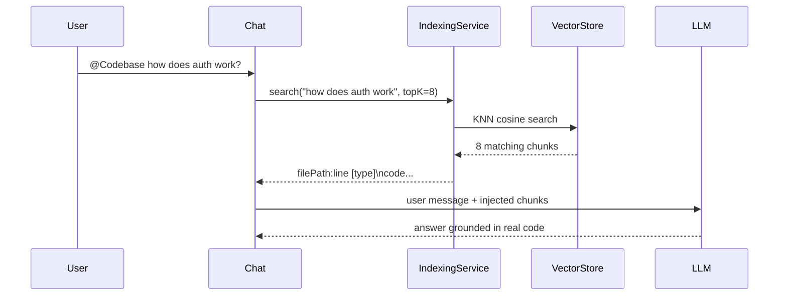

# Champ Features Guide — Phase 1, 2 & 3

> Version 1.6.27 · Last updated 2026-05-13

This guide covers every feature added across the three delivery phases, with step-by-step usage instructions and configuration examples.

---

## Table of Contents

- [Phase 1 — Wiring the Foundation](#phase-1--wiring-the-foundation)
  - [1. @Codebase Semantic Search](#1-codebase-semantic-search)
  - [2. Project Rules (.champ/rules/)](#2-project-rules-champrules)
  - [3. Web Search (@Web)](#3-web-search-web)
  - [4. Checkpoint Save / Restore](#4-checkpoint-save--restore)
  - [5. Token Accounting](#5-token-accounting)
- [Phase 2 — Memory & Intelligence](#phase-2--memory--intelligence)
  - [6. Memory Bank](#6-memory-bank)
  - [7. Context Window Summariser](#7-context-window-summariser)
  - [8. MCP Manager UI](#8-mcp-manager-ui)
  - [9. Agent Dashboard (Session Badges)](#9-agent-dashboard-session-badges)
- [Phase 3 — Ecosystem Foundation](#phase-3--ecosystem-foundation)
  - [10. DAG Composer](#10-dag-composer)
  - [11. Agent Builder (Custom Agents)](#11-agent-builder-custom-agents)
  - [12. Event-driven Triggers](#12-event-driven-triggers)
  - [13. Agent Identity & Registry](#13-agent-identity--registry)

---

# Phase 1 — Wiring the Foundation

---

## 1. @Codebase Semantic Search

Search your entire codebase semantically from the chat input. Instead of copying files manually, type `@Codebase` and Champ finds the most relevant code chunks.

### Setup

**Requires an embedding model running via Ollama:**

```bash
# Pull a lightweight embedding model (recommended)
ollama pull nomic-embed-text

# Or a higher-quality alternative
ollama pull mxbai-embed-large
```

Champ auto-detects embedding models via SmartRouter. Once detected, workspace indexing begins automatically. Watch the **Output** panel (View → Output → Champ) for:

```
Champ: semantic index ready — 4,832 chunks from 183 files (nomic-embed-text)
```

### How to use

Type `@Codebase` followed by your question in the chat input:

```
@Codebase how does the authentication flow work?
@Codebase where is JWT token validation handled?
@Codebase find all database migration files
```

```
┌─────────────────────────────────────────────────┐
│  Champ                                    ⚙ ? ✕ │
├─────────────────────────────────────────────────┤
│                                                 │
│  ┌─────────────────────────────────────────┐   │
│  │ @Codebase how does auth work?           │   │
│  └─────────────────────────────────────────┘   │
│                                                 │
│  Assistant: Based on the code I found:          │
│  // src/auth/auth-service.ts:42-80 [function]   │
│  export async function validateToken(token) {   │
│    const decoded = jwt.verify(token, SECRET);   │
│    ...                                          │
│                                                 │
├─────────────────────────────────────────────────┤
│  ⚙ Auto  🤖 Auto  ████████████████  Send       │
└─────────────────────────────────────────────────┘
```

### What happens internally



---

## 2. Project Rules (.champ/rules/)

Define coding conventions, architectural decisions, and constraints that Champ follows on every turn — without repeating yourself.

### Setup

Create the rules directory in your project:

```bash
mkdir -p .champ/rules
```

Create rule files using Markdown with optional YAML frontmatter:

**`.champ/rules/typescript.md`**
```markdown
---
name: ts-style
type: always
---
Always use `const` over `let` when the variable is not reassigned.
Prefer interfaces over type aliases.
Never use `any` — narrow with `unknown` and type guards instead.
Use named exports, not default exports.
```

**`.champ/rules/testing.md`**
```markdown
---
name: testing-rules
type: auto-attached
glob: "**/*.test.ts"
---
Use vitest. Never use jest.
Each test file must have a describe block with the component name.
Mock external dependencies with vi.fn(). Never mock internal helpers.
```

**`.champ/rules/git-workflow.md`**
```markdown
---
name: git-rules
type: always
---
Commit messages follow Conventional Commits: feat:, fix:, docs:, chore:.
Never commit directly to main. Always create a feature branch.
```

### Rule types

| Type | When injected |
|------|--------------|
| `always` | Every prompt, every turn |
| `auto-attached` | Only when editing a file matching `glob` |
| `agent-requested` | Only when agent explicitly requests it |

### File structure

```
.champ/
  rules/
    typescript.md      ← always active
    testing.md         ← only for *.test.ts files
    security.md        ← always active
    api-design.md      ← always active
```

Rules are loaded automatically when Champ starts or when `.champ/config.yaml` changes. No restart needed.

---

## 3. Web Search (@Web)

Search the web from within the chat using the Brave Search API.

### Setup

**Step 1:** Get a free Brave Search API key (2,000 queries/month free):
- Visit `https://brave.com/search/api/`
- Sign up and copy your key

**Step 2:** Store the key in VS Code:
```
Ctrl+Shift+P → Champ: Set Brave API Key
```

Paste your key (it's stored securely in VS Code's SecretStorage, never in files).

### How to use

```
@Web latest changes in React 19
@Web how to configure nginx reverse proxy for websockets
@Web TypeScript 5.5 new features
```

```
┌─────────────────────────────────────────────────┐
│  @Web React 19 server actions                   │
├─────────────────────────────────────────────────┤
│  Assistant: Based on web search results:        │
│                                                 │
│  1. **React Server Actions** (react.dev)        │
│     https://react.dev/reference/react-dom/...   │
│     Server Actions allow client components to   │
│     call async functions that run on the server │
│                                                 │
│  2. **React 19 Blog Post** (react.dev)          │
│     ...                                         │
└─────────────────────────────────────────────────┘
```

**Rate limits:** Free tier is 10 searches/minute. If exceeded, Champ shows a clear message and waits.

---

## 4. Checkpoint Save / Restore

Save the current state of your open files before a risky agent run, then restore if needed.

### How to use

**Before a risky operation:**

```
Ctrl+Shift+P → Champ: Save Checkpoint
```

A dialog asks for a label. Good labels:
- `before auth refactor`
- `working state after adding tests`
- `before migrating database schema`

```
┌────────────────────────────────────────┐
│  Checkpoint label                      │
│ ┌────────────────────────────────────┐ │
│ │ before auth refactor               │ │
│ └────────────────────────────────────┘ │
│           [Cancel]  [Save Checkpoint]  │
└────────────────────────────────────────┘
```

Confirmation: `Champ: checkpoint "before auth refactor" saved (12 saved file(s) — untitled files excluded).`

**After a bad agent run:**

```
Ctrl+Shift+P → Champ: Restore Checkpoint
```

A quick pick shows all saved checkpoints:

```
┌────────────────────────────────────────────────────┐
│  Select checkpoint to restore                      │
│ ────────────────────────────────────────────────── │
│  before auth refactor    13/05/2026 10:32    12 files │
│  before database schema  12/05/2026 16:45    8 files  │
│  working state           12/05/2026 09:10    21 files │
└────────────────────────────────────────────────────┘
```

**Limits:** Max 10 checkpoints stored, max 50MB total, max 10MB per file. Oldest is auto-evicted.

---

## 5. Token Accounting

Real-time token counts for Ollama, llama.cpp, vLLM, and OpenAI-compatible providers.

### Where to see it

After each multi-agent workflow, a summary appears in chat:

```
✓ planner   2.1s  in=1,204  out=387  tools=0
✓ context   0.8s  in=2,891  out=12   tools=2
✓ code      4.3s  in=4,102  out=823  tools=5
✓ reviewer  1.9s  in=5,247  out=156  tools=0
✓ validator 3.2s  in=1,089  out=44   tools=3
```

**No configuration needed.** Works automatically for all OpenAI-compatible servers that support `stream_options: { include_usage: true }` (vLLM, llama.cpp, LM Studio, Ollama).

---

# Phase 2 — Memory & Intelligence

---

## 6. Memory Bank

Champ remembers key facts across sessions. Ask something once — the agent remembers it next time.

### How it works

After each conversation turn, Champ stores a brief memory:
- User's question (first 120 characters)
- Agent's response summary (first 200 characters)

Stored at `.champ/memory.json` in your workspace (up to 50 entries, FIFO eviction).

On new sessions, the **last 5 memories** are injected into the system prompt:

```
## Recent conversation history
- User asked: "use snake_case for all variable names" → "I'll apply snake_case to all new variable names in this project"
- User asked: "avoid using console.log, use our logger util instead" → "Using src/utils/logger.ts for all logging"
- User asked: "the auth module is off-limits, don't touch it" → "I'll avoid modifying src/auth/ and related files"
```

### Seeing it in action

**Session A:**
```
You: Our database naming convention uses snake_case for all columns.
     New tables should always have created_at and updated_at timestamps.

Champ: Understood! I'll use snake_case for column names and include
       created_at/updated_at timestamps on all new tables.
```

**New Chat (Session B):**
```
You: Add a users table to the schema.

Champ: I'll create the users table following our snake_case convention
       with created_at and updated_at timestamps...
       [correctly applies the convention without being told again]
```

### Inspecting / clearing memory

```bash
# View current memories
cat .champ/memory.json

# Clear all memories
rm .champ/memory.json
```

---

## 7. Context Window Summariser

Instead of silently dropping old messages when context fills, Champ summarises them and keeps the summary.

### What you'll see

In the VS Code **Output** panel (Champ channel) during long sessions:

```
# Before fix (silent loss):
Champ: context window — dropped 8 oldest message(s) to fit

# After fix (with summariser):
Champ: context window — compacted 8 oldest message(s) with summary
```

The injected summary looks like:
```
[Earlier conversation summary: We discussed refactoring the auth module 
to use JWT tokens. The old session-based auth was removed. Key decision: 
tokens expire after 24 hours with a 7-day refresh window.]
```

### When it triggers

Most useful with:
- Small local models (qwen3:8b, llama3:8b) with 4K–8K context windows
- Long debugging or refactoring sessions (10+ turns)
- Large file attachments that consume much of the context

With large-context models (Claude, GPT-4, 128K+) it rarely triggers.

---

## 8. MCP Manager UI

Visual panel showing the status of every MCP (Model Context Protocol) server.

### Setup

Add MCP servers to `.champ/config.yaml`:

```yaml
mcp:
  servers:
    - name: github
      command: npx
      args: ["-y", "@modelcontextprotocol/server-github"]
      env:
        GITHUB_TOKEN: ${{ secrets.GITHUB_TOKEN }}

    - name: playwright
      command: npx
      args: ["-y", "@modelcontextprotocol/server-playwright"]

    - name: filesystem
      command: npx
      args: ["-y", "@modelcontextprotocol/server-filesystem", "/home/user/projects"]
```

Store secrets:
```
Ctrl+Shift+P → Champ: Set Secret
Key: GITHUB_TOKEN
Value: ghp_xxxxxxxxxxxx
```

### How to use

Click the **🔌 plug icon** in the action bar below the chat:

```
┌─────────────────────────────────────────────────┐
│  Champ                                    ⚙ ? ✕ │
├─────────────────────────────────────────────────┤
│  [messages area]                                │
│                                                 │
├─────────────────────────────────────────────────┤
│ ┌─────────────────────────────────────────────┐ │
│ │ 🔌 MCP Servers                              │ │
│ │ ● github      12 tools               [↺]   │ │
│ │ ● playwright   8 tools               [↺]   │ │
│ │ ✕ filesystem  disconnected: ENOENT   [↺]   │ │
│ └─────────────────────────────────────────────┘ │
│  🔌  [New Chat]  [Plan]  [Agent]  [Ask]         │
└─────────────────────────────────────────────────┘
```

| Badge | Meaning |
|-------|---------|
| ● (green) | Connected — shows tool count |
| ✕ (red) | Failed — shows error reason |

Click **↺** to reload a specific server without restarting everything.

---

## 9. Agent Dashboard (Session Badges)

Session tabs now show real-time status badges.

```
┌──────────────────────────────────────────────┐
│ ● Auth refactor  New chat  ● API migration  + │
└──────────────────────────────────────────────┘
```

| Badge | Colour | Meaning |
|-------|--------|---------|
| ● pulsing | Green | Agent actively running in that session |
| ● solid | Red | Last run ended with an error |
| ● solid | Orange | Run was cancelled/aborted by user |
| _(none)_ | — | Session idle or completed cleanly |

**Use case:** Open 3 sessions — run a long refactor in session 1, do quick Q&A in session 2. The green pulsing badge shows session 1 is still running without switching to it.

---

# Phase 3 — Ecosystem Foundation

---

## 10. DAG Composer

Run agents in a dynamic DAG (Directed Acyclic Graph) instead of a fixed linear sequence. Nodes can be skipped or route to different agents based on output.

### DAGNode API

```typescript
interface DAGNode {
  name: string;
  // Skip this node entirely when condition returns false
  condition?: (memory: SharedMemory) => boolean;
  // Route to a named node (null = stop the workflow)
  next?: (output: AgentOutput, memory: SharedMemory) => string | null | undefined;
}
```

### Example: Smart review workflow

```typescript
import { AgentOrchestrator } from "./src/agent/orchestrator";

const orch = new AgentOrchestrator();
// ... register agents ...

const result = await orch.executeDAG("Add user registration endpoint", [
  { name: "planner" },

  // Only gather context if the plan involves file reads
  {
    name: "context",
    condition: (memory) => {
      const plan = memory.getOutput("planner");
      return (plan?.plan?.steps ?? []).some(s => s.targetFiles?.length > 0);
    },
  },

  { name: "code" },

  // Reviewer decides: re-do code, or skip straight to validator
  {
    name: "reviewer",
    next: (output, memory) => {
      if (output.approved) return "validator";  // fast path
      return "code";                            // retry code
    },
  },

  { name: "validator" },
]);
```

### Workflow diagram

```
planner → context? → code → reviewer ─── approved ──→ validator → done
                               ↑                │
                               └── rejected ────┘
```

### Available via code (not yet in UI)

`executeDAG` is available programmatically. Use it in custom VS Code commands, scripts, or extensions built on top of Champ.

---

## 11. Agent Builder (Custom Agents)

Define your own agents as Markdown files — no TypeScript required.

### Create a custom agent

Create `.champ/agents/` directory in your project, then add `.md` files:

**`.champ/agents/security-auditor.md`**
```markdown
---
name: security-auditor
role: Scans code for security vulnerabilities
outputKey: security_audit
---
You are a security code reviewer specializing in web application security.

Analyze the provided code for vulnerabilities including:
- SQL injection, XSS, CSRF
- Exposed secrets or API keys
- Insecure direct object references
- Missing authentication/authorization checks
- Unsafe deserialization

Output JSON only:
{
  "findings": [
    {"severity": "high"|"medium"|"low", "description": "...", "file": "...", "line": 0}
  ],
  "passed": boolean,
  "summary": "one sentence summary"
}
```

**`.champ/agents/docs-writer.md`**
```markdown
---
name: docs-writer
role: Writes technical documentation for code
outputKey: documentation
---
You are a technical writer. Given source code, produce clear API documentation.

Format as Markdown with:
- One-paragraph overview
- Parameters table (if applicable)
- Return value description
- Usage example
- Common pitfalls

Be concise. Developers read this under time pressure.
```

**`.champ/agents/migration-helper.md`**
```markdown
---
name: migration-helper
role: Generates database migration SQL
outputKey: migration_sql
---
You are a database architect. Given a schema change description, produce:
1. Forward migration SQL (CREATE TABLE, ALTER TABLE, etc.)
2. Rollback migration SQL (DROP, revert ALTERs)

Use PostgreSQL syntax. Include transactions. Output JSON:
{"up": "SQL here", "down": "SQL here", "description": "what this does"}
```

### How they load

Custom agents are loaded automatically when Champ starts:

```
Champ: loaded custom agent "security-auditor" from .champ/agents/
Champ: loaded custom agent "docs-writer" from .champ/agents/
Champ: loaded custom agent "migration-helper" from .champ/agents/
```

### Using custom agents in multi-agent workflows

Use `champ.runMultiAgent` and specify a custom sequence:

```
Ctrl+Shift+P → Champ: Run Multi-Agent Workflow
Task: Audit the authentication module for security issues
```

Or configure triggers (see next section) to run them automatically.

### Frontmatter reference

| Field | Required | Description |
|-------|----------|-------------|
| `name` | ✅ | Unique agent identifier (used in sequences and triggers) |
| `role` | ✅ | Human-readable role description |
| `outputKey` | ❌ | Key under which output is stored in SharedMemory (defaults to `name`) |

---

## 12. Event-driven Triggers

Run named agents automatically when files are saved or changed.

### Configuration

Add `triggers:` to `.champ/config.yaml`:

```yaml
triggers:
  - name: "security scan on TypeScript save"
    glob: "src/**/*.ts"
    on: save
    run: security-auditor
    debounceMs: 3000

  - name: "doc update on API change"
    glob: "src/api/**/*.ts"
    on: save
    run: docs-writer
    debounceMs: 5000

  - name: "watch for config drift"
    glob: ".champ/**/*.yaml"
    on: change
    run: validator
    debounceMs: 1000
```

### Trigger fields

| Field | Required | Default | Description |
|-------|----------|---------|-------------|
| `name` | ✅ | — | Display name for logs and notifications |
| `glob` | ✅ | — | File pattern to watch (e.g., `**/*.ts`, `src/**/*.py`) |
| `on` | ❌ | `save` | `"save"` triggers on file save; `"change"` on any edit |
| `run` | ✅ | — | Agent name to run (must be registered: built-in or custom) |
| `debounceMs` | ❌ | `2000` | Milliseconds to wait after last file event before running |

### What triggers are available

**Built-in agents:**
- `planner` — breaks tasks into steps
- `context` — gathers relevant code context
- `code` — makes code changes
- `reviewer` — reviews diffs
- `validator` — runs linting/tests

**Custom agents** (from `.champ/agents/*.md`):
- Any agent you've defined (e.g., `security-auditor`, `docs-writer`)

### Example: Security scan on every save

```
┌─────────────────────────────────────────────────────┐
│ File saved: src/auth/login.ts                       │
│                                                     │
│ [after 3 second debounce]                           │
│                                                     │
│ Champ trigger "security-auditor" on "login.ts": done│
└─────────────────────────────────────────────────────┘
```

A notification pops up with the result. More detail in the Output panel.

### Full config example

```yaml
provider: ollama

providers:
  ollama:
    model: qwen3:8b

mcp:
  servers:
    - name: github
      command: npx
      args: ["-y", "@modelcontextprotocol/server-github"]
      env:
        GITHUB_TOKEN: ${{ secrets.GITHUB_TOKEN }}

triggers:
  - name: "security on save"
    glob: "src/**/*.ts"
    on: save
    run: security-auditor
    debounceMs: 3000

  - name: "validate on config change"
    glob: ".champ/**"
    on: change
    run: validator
    debounceMs: 1000
```

---

## 13. Agent Identity & Registry

Agents can declare a stable identity with capabilities. The `AgentRegistry` enables future agent-to-agent (A2A) routing.

### AgentIdentity interface

```typescript
interface AgentIdentity {
  id: string;                    // stable ID: "built-in:planner", "custom:security-auditor"
  version?: string;              // semver: "1.0.0"
  capabilities: Array<           // what this agent can do
    "read" | "write" | "execute" | "llm" | "search" | "review"
  >;
  trusted?: boolean;             // can perform destructive operations
}
```

### Adding identity to a custom agent

For TypeScript agents, add the `identity` field:

```typescript
export class SecurityAuditorAgent implements Agent {
  name = "security-auditor";
  role = "Scans code for security vulnerabilities";
  identity: AgentIdentity = {
    id: "custom:security-auditor",
    version: "1.0.0",
    capabilities: ["read", "llm", "review"],
    trusted: false,
  };

  async execute(...) { ... }
}
```

### Using AgentRegistry

```typescript
import { AgentRegistry } from "./src/agent/agent-registry";

const registry = new AgentRegistry();
registry.register(myAgent);

// Look up by stable ID
const agent = registry.get("custom:security-auditor");

// Find all agents that can review code
const reviewers = registry.findByCapability("review");

// List all registered agents
const all = registry.list();
```

### Current state

Agent identity is opt-in. Built-in agents (planner, code, reviewer, etc.) don't yet declare identities — this will be added in Phase 5 when the A2A protocol is implemented.

---

## Quick Reference Card

```
┌─────────────────────────────────────────────────────────────────┐
│  CHAMP FEATURE QUICK REFERENCE                                  │
├────────────────┬────────────────────────────────────────────────┤
│  PHASE 1       │                                                │
├────────────────┼────────────────────────────────────────────────┤
│  @Codebase     │ Needs: ollama pull nomic-embed-text            │
│                │ Use:   @Codebase <your question>               │
├────────────────┼────────────────────────────────────────────────┤
│  Rules         │ Create: .champ/rules/*.md                      │
│                │ Types: always | auto-attached | agent-requested│
├────────────────┼────────────────────────────────────────────────┤
│  @Web search   │ Setup: Ctrl+P → Champ: Set Brave API Key       │
│                │ Use:   @Web <query>                            │
├────────────────┼────────────────────────────────────────────────┤
│  Checkpoints   │ Save:    Ctrl+P → Champ: Save Checkpoint       │
│                │ Restore: Ctrl+P → Champ: Restore Checkpoint    │
├────────────────┼────────────────────────────────────────────────┤
│  PHASE 2       │                                                │
├────────────────┼────────────────────────────────────────────────┤
│  Memory Bank   │ Auto — stored in .champ/memory.json            │
│                │ Last 5 facts injected into each new session    │
├────────────────┼────────────────────────────────────────────────┤
│  Summariser    │ Auto — fires when context window is full       │
│                │ Visible in Output panel (Champ channel)        │
├────────────────┼────────────────────────────────────────────────┤
│  MCP UI        │ Click 🔌 in action bar below chat              │
│                │ Shows: connected/error status + tool count     │
├────────────────┼────────────────────────────────────────────────┤
│  Session dots  │ Auto — pulsing green = running                 │
│                │ Red = error · Orange = aborted                 │
├────────────────┼────────────────────────────────────────────────┤
│  PHASE 3       │                                                │
├────────────────┼────────────────────────────────────────────────┤
│  Custom agents │ Create: .champ/agents/*.md                     │
│                │ Loaded automatically on startup                │
├────────────────┼────────────────────────────────────────────────┤
│  Triggers      │ Config: triggers: in .champ/config.yaml        │
│                │ on: save | change + glob + run: agent-name     │
├────────────────┼────────────────────────────────────────────────┤
│  DAG Composer  │ API: orch.executeDAG(request, nodes)           │
│                │ Each node: condition? + next? functions        │
└────────────────┴────────────────────────────────────────────────┘
```

---

## Complete .champ/config.yaml Reference

```yaml
# Primary provider for chat
provider: ollama              # ollama | claude | openai | gemini | llamacpp | vllm | openai-compatible

# Per-provider settings
providers:
  ollama:
    model: qwen3:8b
    baseUrl: http://localhost:11434
  claude:
    model: claude-sonnet-4-20250514
    # API key stored in VS Code SecretStorage, not here
  openai:
    model: gpt-4o
  openai-compatible:
    model: llama3.1:8b
    baseUrl: http://localhost:8080

# Autocomplete (inline suggestions)
autocomplete:
  enabled: true
  debounceMs: 300
  provider: ollama
  model: qwen2.5-coder:1.5b

# Agent behaviour
agent:
  defaultMode: agent           # agent | ask | manual | plan | composer
  yoloMode: false              # skip approval prompts
  promptGuard:
    enabled: true

# Semantic indexing (@Codebase)
indexing:
  enabled: true
  embeddingProvider: ollama
  embeddingModel: nomic-embed-text
  ignore:
    - "node_modules/**"
    - "dist/**"
    - ".git/**"

# MCP servers
mcp:
  servers:
    - name: github
      command: npx
      args: ["-y", "@modelcontextprotocol/server-github"]
      env:
        GITHUB_TOKEN: ${{ secrets.GITHUB_TOKEN }}

# Event-driven triggers (Phase 3)
triggers:
  - name: "security scan on save"
    glob: "src/**/*.ts"
    on: save
    run: security-auditor
    debounceMs: 3000

# Smart model routing
routing:
  mode: smart                  # smart | manual
  # coding: qwen3:8b           # override for coding tasks
  # chat: llama3.1:8b          # override for chat

# Always-on project rules (injected into every prompt)
userRules: |
  Use TypeScript strict mode.
  All functions must have JSDoc comments.
  Follow the existing code style.

# Telemetry (optional)
telemetry:
  enabled: false
  endpoint: "http://localhost:4318/v1/traces"
  format: otlp                 # otlp | json
```

---

*Champ v1.6.27 · https://github.com/hellodk/champ*
